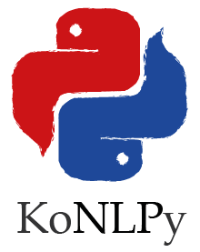

# Dowon-BE : 🇰🇷 💬

## 프로젝트 소개
- konlpy 형태소 탐지
- BERT 감성 분석 with Django
- 은어 탐지 변환 앱 백엔드

## 자연어 처리 기술

|                     konlpy                      |                     kobert                     | 
|:-----------------------------------------------:|:----------------------------------------------:|
|  |  |
 

## 구현 기능

- 은어 검색 기능
- 은어 변환 기능
- 감성 분석 기능
- 커뮤니티 기능

 

## 배운 점 & 아쉬운 점

- Docker 활용 - ubuntu
- Aws 서버 구현
- Colab Bert 모델 구현
- Konlpy okt 형태소 분석
- git action 자동 배포

## 라이센스

MIT &copy; [Chwangmin](mailto:ckm7907@gmail.com)